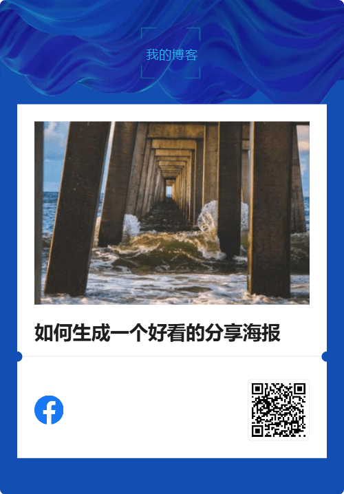
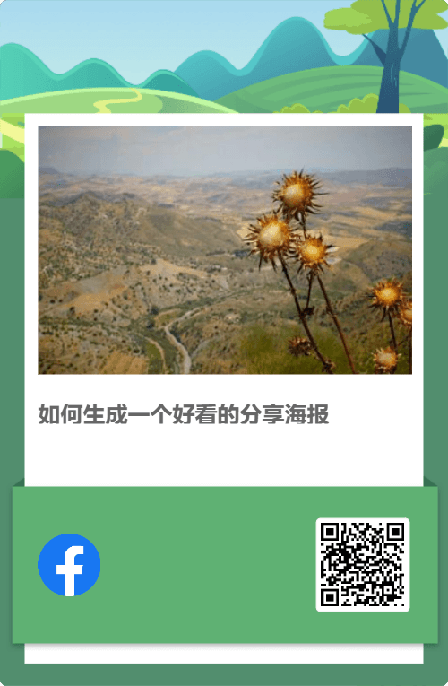
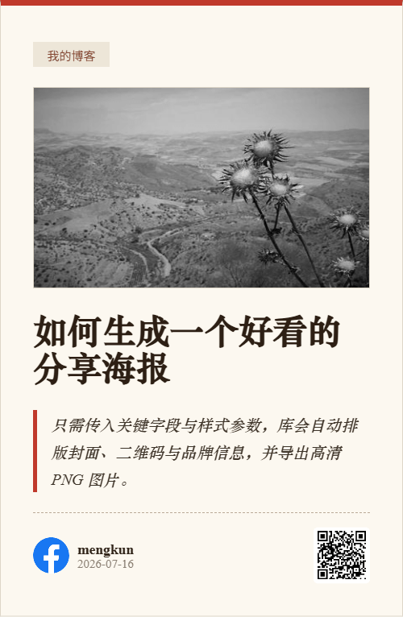

# PosterCard

通用前端海报生成库。只需传入**关键字段**与**样式参数**，即可在浏览器中渲染并导出分享海报图片（PNG）。

- 不依赖任何后端 / 框架，纯前端运行
- 模板化：每个版式是独立、可直接打开预览的 HTML 文件（`tpl/<模板名>/index.html`）
- 内置多种版式，可自行开发模板进行扩展
- 自动生成二维码、加载封面图（含 CORS 处理）、高清导出
- **圆角透明边角**：模板根节点（`.pg-root`）自带非 0 圆角时，导出 PNG 会自动把圆角外的区域擦成透明，不再残留白色矩形边角（无需额外参数，由模板设计决定）
- 依赖 `html2canvas` 与 `qrcode.js`，**需由调用方在页面中自行引入**；生成时若缺失会直接报错


## 模板一览

内置 16 种版式，每个版式均提供预览图（`tpl/<模板名>/preview.png`）：

| TEPoster (default) | NiceTheme (nicetheme) | 网易云 (netease) | 深色卡片 (minimal) |
| --- | --- | --- | --- |
|  |  |  |  |

> 以上四种样式来自开源项目：https://github.com/SurGarfield/TEPoster

| 闪电博-卡片 (dwqr) | 闪电博-极光 (dwqr1) | 闪电博-科技蓝 (dwqr2) | 闪电博-绿野仙踪 (dwqr3) |
| --- | --- | --- | --- |
|  |  |  |  |

> 以上四种样式来自闪电博：https://www.wbolt.com/

| 经典报纸 (newspaper) | 经典卡片 (classic) | 杂志拼贴 (collage) | 侧边栏 (sidebar) |
| --- | --- | --- | --- |
|  |  |  |  |

| 文学 (literary) | 极简白 (plain) | 暗黑科技 (dark) | 手绘涂鸦 (doodle) |
| --- | --- | --- | --- |
|  |  |  |  |


## 快速开始

在页面中引入样式、依赖与脚本：

```html
<link rel="stylesheet" href="postercard.css" />
<!-- 依赖：html2canvas 与 qrcode.js，由调用方自行提供 -->
<script src="assets/vendor/html2canvas.min.js"></script>
<script src="assets/vendor/qrcode.min.js"></script>
<script src="postercard.js"></script>
```

压缩版（`dist/`）引入方式相同，只是换成 `.min` 文件：

```html
<!-- 方式一：压缩版（依赖仍需自行引入） -->
<link rel="stylesheet" href="dist/postercard.min.css" />
<script src="assets/vendor/html2canvas.min.js"></script>
<script src="assets/vendor/qrcode.min.js"></script>
<script src="dist/postercard.min.js"></script>

<!-- 方式二：一体化版 postercard.full.min.js，已内置 html2canvas 与 qrcode，开箱即用 -->
<link rel="stylesheet" href="dist/postercard.min.css" />
<script src="dist/postercard.full.min.js"></script>
```

调用 `PosterCard.generate(options)`：

```js
PosterCard.generate({
  fields: {
    title: '文章标题',
    summary: '文章摘要',
    cover: 'https://example.com/cover.jpg', // 封面图 URL
    url: 'https://example.com/article/123', // 二维码内容
    siteName: '我的站点',
    logo: 'https://example.com/logo.png',    // 可选
    author: '作者名',                        // 可选
    authorAvatar: 'https://example.com/a.png', // 可选
    date: '2026-07-16',                      // 可选，ISO 日期
    brandDesc: '底部品牌描述'                 // 可选
  },
  style: {
    template: 'default',   // default | nicetheme | netease | minimal | dwqr | dwqr1 | dwqr2 | dwqr3 | newspaper | classic | collage | sidebar | literary | plain | dark | doodle
    width: 400,            // 海报宽度 px
    defaultCover: ''       // 可选，封面缺省图
  },
  output: {
    showModal: true,       // 生成后弹窗预览，默认 true
    filename: 'postercard.png' // 下载文件名
  }
}).then(function (result) {
  // result: { canvas, blob, dataUrl, url, download() }
  console.log(result.dataUrl);
});
```


## 目录结构

```
PosterCard/
├── LICENSE                 # MIT 协议
├── index.html              # 演示页面（可直接打开体验，含实时预览 / 复制调用代码 / 一键预览全部主题）
├── postercard.js           # 核心库（UMD，暴露全局 PosterCard）
├── postercard.css          # 库自身 UI 样式（弹窗 / 遮罩 / 离屏容器）
├── tpl/                    # 模板目录：每个一个文件夹（含 index.html），详见「模板一览」
└── assets/
    ├── vendor/
    │   ├── html2canvas.min.js
    │   └── qrcode.min.js
    └── postercard.webp      # 封面缺省占位图
```

> 模板文件自带 CSS（`<style>`），**可直接用浏览器打开预览**，也方便可视化调整样式。
> 部分模板通过 Google Fonts CDN 加载特色字体；离线时会回退到系统字体，不影响功能。


## 模板系统

每个模板是 `tpl/<模板名>/index.html`，一个**自包含、可直接打开预览**的 HTML 文件：

- 文件内含 `<style>`（该模板的全部样式），所以双击打开就能看到排版效果；
- 用「占位符 / 行为属性」标记待替换内容，方便可视化调整；
- 生成时，库会 `fetch` 该文件，替换占位符、执行行为属性，再用 `html2canvas` 出图。

### 新增一个模板

1. 新建 `tpl/<你的模板名>/index.html`；
2. 在 `<style>` 中写完整样式（含 `.pg-root` 基础样式），根元素加 `class="pg-root pg-<名>"`；
3. 用 `data-pg-text` / `{{field}}` 与 `data-pg-*` 标记可替换内容，并填入示例文本便于预览；
4. （可选）用内联 `<script>` 注册扩展函数；
5. 调用时 `style.template: '<你的模板名>'` 即可（默认从 `tpl/` 加载，可用 `deps.templateBase` 修改根目录）。

### 占位符（文本 / 属性）

- 文本绑定：`<div data-pg-text="title"></div>`。元素内可写**示例文本**用于预览，生成时被覆盖。
- 行内 token：在文本或属性里写 `{{field}}`，例如 `<p>{{summary}}</p>`、`alt="{{siteName}}"`。

### 扩展函数（管道）

占位符支持管道调用扩展函数，用于字符截断、日期格式、取默认值等：

```html
<p data-pg-text="summary | truncate:80"></p>
<div data-pg-text="author | default:@siteName"></div>
```

- 多个函数可串联：`{{x | trim | truncate:20}}`
- 参数以逗号分隔；以 `@` 开头的参数表示**引用另一个字段**，如 `default:@siteName`
- 内置函数：
  - `truncate:n[,ellipsis]` — 截断到 n 个字符（默认省略号 `…`）
  - `default:fallback` — 为空时取 fallback（`@` 引用字段）
  - `trim` / `upper` / `lower` — 字符串处理
  - `date:format` — 日期格式化：`cn`(2026年07月16日) / `iso`(2026-07-16) / `ym`(2026.07) / `md`(07-16) / `default`(Jul.2026) / `upper`(JUL.2026)

### 行为属性（data-pg-*）

| 属性 | 说明 |
| --- | --- |
| `data-pg-text="field \| fn:arg"` | 文本绑定（可被扩展函数处理），生成时覆盖元素文本 |
| `data-pg-if="field"` | 字段为空则隐藏元素；支持 `!field` 取反，逗号分隔多字段（AND） |
| `data-pg-cover` | 封面图：`` 设 `src`，容器则设 `backgroundImage`；含缺省图 / 占位回退 |
| `data-pg-img="field"` | 普通图片（logo 等）：设 `src`，字段为空则隐藏 |
| `data-pg-qr` `[data-pg-qr-size="px"]` `[data-pg-qr-color="#000"]` `[data-pg-qr-bg="#fff"]` | 生成二维码（内容取 `fields.url`）；`color` 前景色、`bg` 背景色，缺省黑/白，可用配色与卡片风格融合 |
| `data-pg-date` `[data-pg-date-variant="upper\|default"]` | 日期徽标；子元素用 `data-pg-date-day` / `data-pg-date-monthyear` |
| `data-pg-favicon` | 站点图标 / 作者头像（minimal 用；有头像用头像，否则用 logo，都没有则隐藏） |

### 自定义扩展函数

在模板文件末尾用内联 `<script>` 注册本模板的扩展函数与 `onRender` 钩子：

```html
<script>
  (function () {
    var name = 'netease';
    window.PosterCardTpl = window.PosterCardTpl || {};
    window.PosterCardTpl[name] = {
      helpers: {
        // 自定义函数：接收 (value, ...args, ctx)，返回新值
        by: function (v) { return v ? 'by ' + v : ''; }
      },
      // 可选：渲染完成后的钩子，用于特殊展现效果
      onRender: function (root, data, ctx) { /* root.querySelector(...) ... */ }
    };
  })();
</script>
```

也可在 JS 中通过 `PosterCard.registerHelpers('模板名', { helpers, onRender })` 注册。


## 参数说明

### fields（关键字段）

| 字段 | 类型 | 必填 | 说明 |
| --- | --- | --- | --- |
| `title` | string | 是 | 海报标题 |
| `summary` | string | 否 | 摘要 / 正文片段 |
| `cover` | string | 否 | 封面图 URL，留空使用 `defaultCover` 或内置占位图 |
| `url` | string | 是 | 二维码内容，通常为页面链接 |
| `siteName` | string | 否 | 站点 / 品牌名 |
| `logo` | string | 否 | 品牌 logo URL |
| `author` | string | 否 | 作者名（netease / minimal 用） |
| `authorAvatar` | string | 否 | 作者头像 URL（与 author 同时提供时 minimal 显示头像） |
| `date` | string | 否 | ISO 日期，如 `2026-07-16` |
| `brandDesc` | string | 否 | 底部品牌描述（nicetheme 用） |

### style（样式参数）

| 参数 | 类型 | 默认 | 说明 |
| --- | --- | --- | --- |
| `template` | string | `default` | 版式（见「模板一览」）：`default` / `nicetheme` / `netease` / `minimal` / `dwqr` / `dwqr1` / `dwqr2` / `dwqr3` / `newspaper` / `classic` / `collage` / `sidebar` / `literary` / `plain` / `dark` / `doodle` |
| `width` | number | `400` | 海报宽度（px），建议 360–600 |
| `defaultCover` | string | 内置图 | 封面缺省图 URL |

### output（输出配置）

| 参数 | 类型 | 默认 | 说明 |
| --- | --- | --- | --- |
| `showModal` | boolean | `true` | 生成后是否弹窗预览 |
| `filename` | string | `postercard.png` | 下载文件名 |

### deps（依赖配置，可选）

| 参数 | 类型 | 默认 | 说明 |
| --- | --- | --- | --- |
| `assetsBase` | string | `assets` | 资源根目录，用于定位占位图 `postercard.webp` |
| `templateBase` | string | `tpl` | 模板目录根，用于定位 `tpl/<模板名>/index.html` |

> 注意：`html2canvas` 与 `qrcode.js` 必须由调用方在页面里用 `<script>` 引入。
> 若生成时检测到二者缺失，库会直接抛出错误：`缺少依赖：html2canvas、qrcode。请在页面中先引入对应脚本。`


## 本地预览

模板文件可直接双击打开预览；完整生成流程建议用本地静态服务器（模板通过 `fetch` 加载，需 http 协议）：

```bash
npm start          # 启动 Node 静态服务（默认 http://localhost:8080/）
# 或自定义端口： PORT=3000 npm start
# 浏览器访问 http://localhost:8080/
```


## 注意事项

- 跨域图片需服务端允许 CORS，否则 html2canvas 无法绘制（库已自动设置 `crossOrigin`）。
- 生成的图片为 PNG，分辨率按设备像素比与像素预算自动优化，兼顾清晰度与性能。
